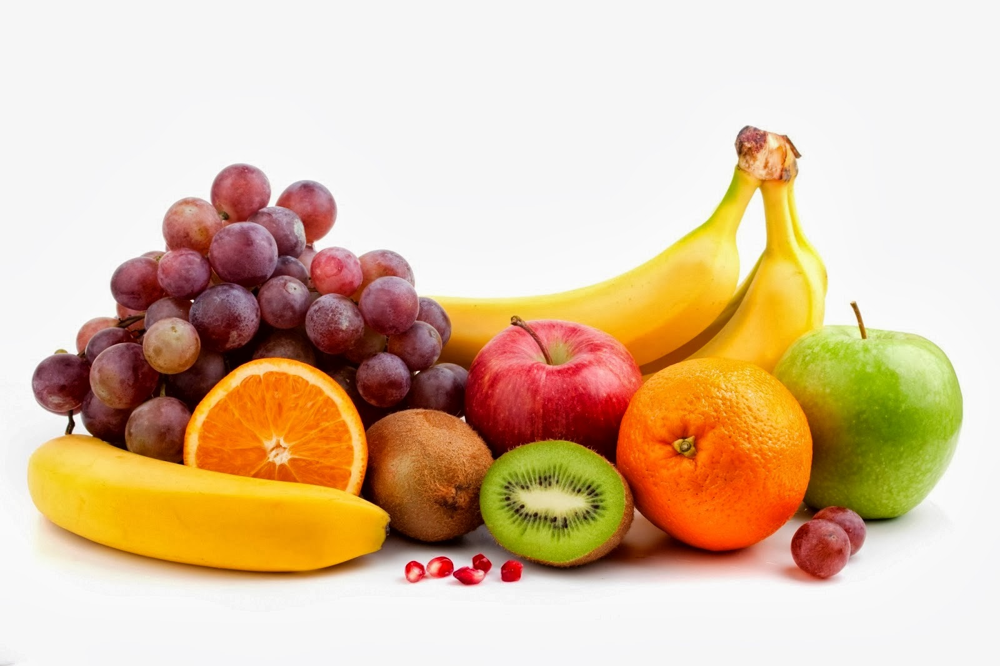
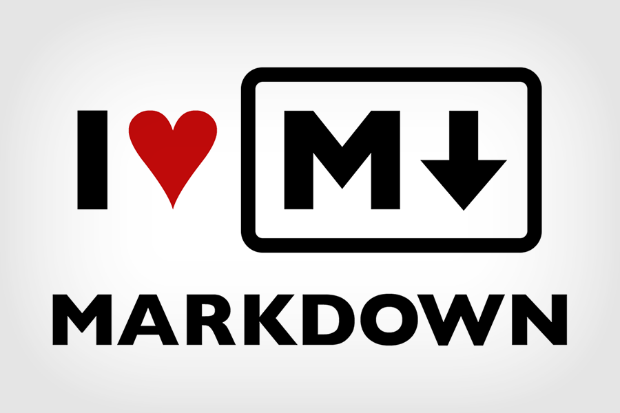
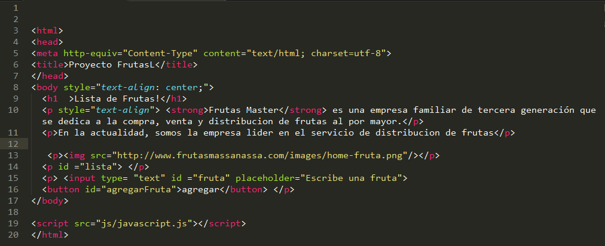
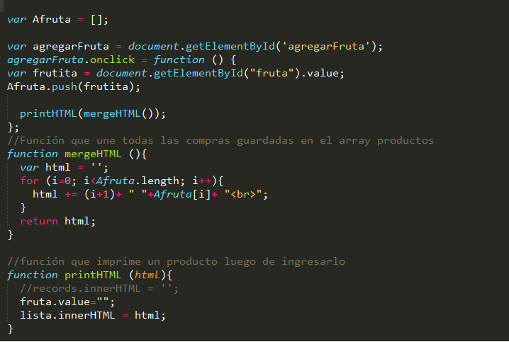

# frutas
## Lista de frutas
### Mi proyecto 

1 En este proyecto vamos a utilizar el *MARKDOWN*:
	*Que permite dar **formato** al texto al igual que un HTML, estas modificaciones las hacemos dentro del README.md

2 Tambien debemos de elaborar el codigo en nuestros:
> archivos html y js respectivamente.

Este es mi **código en html**:

Este es mi codigo en javascript:

***
[link del capitan][1]
[1]: http://capitan-dev.laboratoria.la/tracks/2/courses/14/units/34/lessons/113/pages/696
